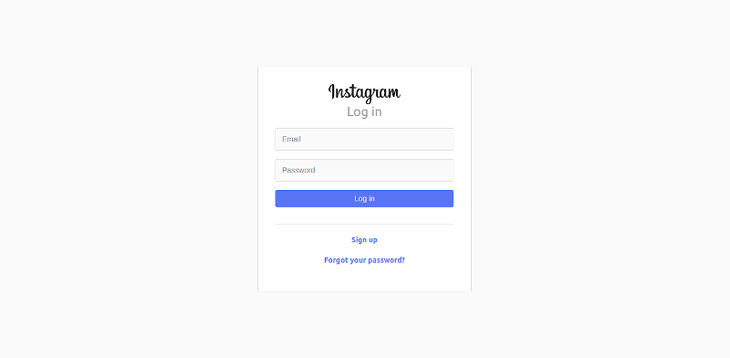
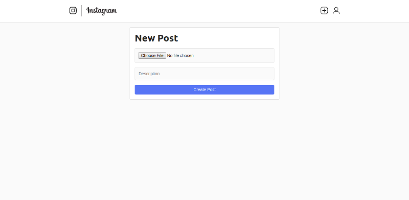
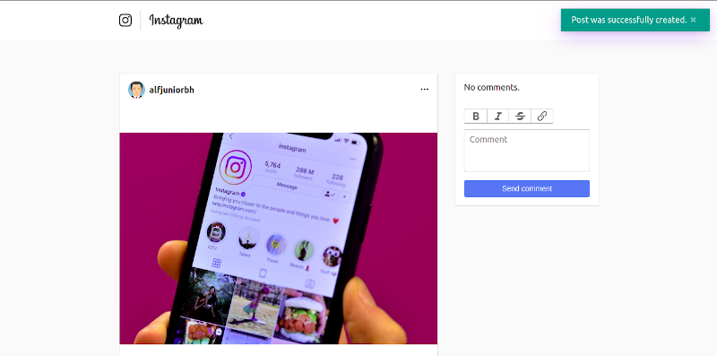
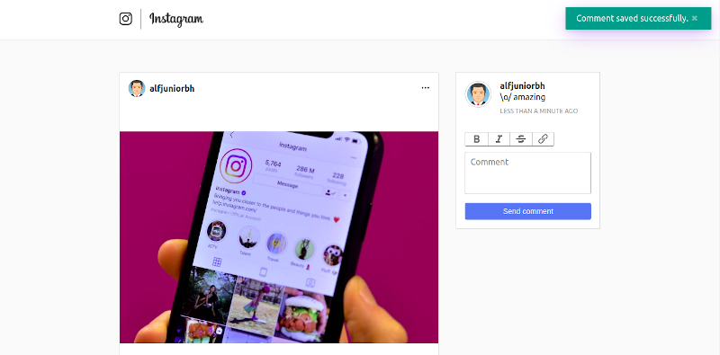

# Instagram Clone

Project developed with Ruby 2.6.0 and Rails 6.0, applying advanced features of Broadcasting in Posts and Comments to be updated in real time in all browsers.
A Devise authentication system was also implemented, which allows the creation of new user accounts, Login and password recovery.

